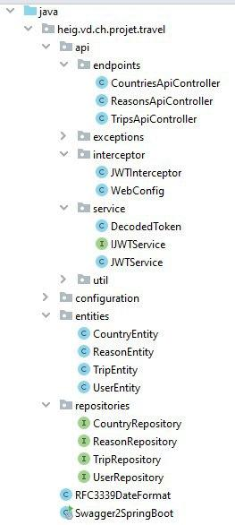
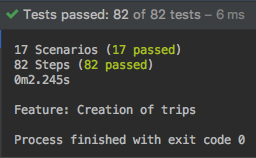
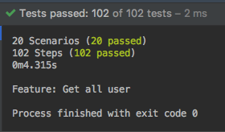

# Teaching-HEIGVD-AMT-2019-Project-Two

> François Burgener, Tiago Povoa Q.

## In short

Implementation of 2 Restful API using Spring Boot, Swagger, JWT and Cucumber

## Introduction

*If you need to start the project in a dev environment, go to the appropriate section at the end of this document*

### Quick Start

To run this project, first go to `topology/prod`. 

You'll have to add env variables. For example by adding `topology/prod/.env` file like the following:

```
ROOT_PASSWORD=admin
MYSQL_DATABASE_AUTH=authentication_api
MYSQL_DATABASE_TRAVEL=travel_api

DB_PORT=3306
TOKEN_SECRET=secret

DB_USERNAME=root
```

Then start it with `docker-compose up`. It will run a few containers:

* Traefik that we use as a dynamic reverse proxy. Don't mind the funny gophers in here.
* Two Spring APIs: Auth and Travel
* Two MySQL Databases
* A phpmyadmin container so you can inspect data

#### Hosts

We all enjoy a pretty url instead of typing the docker host IP. So we edited the host file.

Mac/Linux: `/etc/hosts`

```
127.0.0.1 www.todotravel.ch
```

Windows: `windows\system32\drivers\etc\hosts`

```
192.168.99.100 www.todotravel.ch
```

#### Have a look to the Swagger specs

If you need the specification of both APIs, you can visit the following:

* Travel API: http://www.todotravel.ch/api-travel
* Auth API: http://www.todotravel.ch/api-auth

In case you want to check the swagger spec files, you can see them in here:

`microservices/travel/spring-server/src/main/resources/api-spec.yaml`

`microservices/authentication/spring-server/src/main/resources/api-spec.yaml`

#### Demo

Here is a usage example:


We authentify by using a authDTO payload to pass the email and password,

```json
{
  "email": "admin@admin.ch",
  "password": "admin"
}
```

and we retrieve the JWT token in the response body.

## Business domain

### Database

For our business domain, we choose the same as the previous project. 

In our Travel API, users make trips to countries with some main reason. You can see our database model in the following picture:


In the second API who manages authentication, we have an extanded full user table. In the following, we store the password hashes, as well as the role of the user and her personal information. 


### Implementation

Let's dive into the implementation


* Api/
  * Endpoints: Controllers that define ours HTTP Routes.
  * Interceptor: We use an interceptor to intercept an incoming HTTP Request, check the Authorization header for a correct token.
  * Service: A few utils that allow us to create JWT tokens as well as verifying it. Authenticate service is about hashing the password (using BCrypt). 
* Entities : Here we have our JPA Entities. Simple POJOs that are managed by the Entity Manager
* Repositories: The repositories, used as an abstraction layer over the DB. 



And similarly, we did it in the same fashion for the second API.

#### Some details

Let's see a bit of code to understand some choices we made

```java
@Entity
@Table(name = "Trip")
public class TripEntity implements Serializable {
    @Id
    @GeneratedValue(strategy = GenerationType.IDENTITY)
    @Column(name = "idTrip")
    private Integer idTrip;

    ...

    @ManyToOne
    @JoinColumn(name = "Reason_idReason")
    private ReasonEntity reasonEntity;

    @ManyToOne
    @JoinColumn(name = "Country_idCountry")
    private  CountryEntity countryEntity;
}
```

Here, we used the annotation @ManyToOne to specify that this POJO field is a reference to another Entity, which corresponds to a join in the database. 

___

```java
public interface TripRepository extends CrudRepository<TripEntity, Integer> {
    Page<TripEntity> findAllByEmailEquals(String string, Pageable pageable);
}
```

In this small extract, we see the code of a repository. We used a Pageable parameter, and a Page return type to implement the paging. As we can see, it's by far easier in comparison to the previous project.

## Testing strategy

### Running tests

To launch tests, we made some scripts to make life easier.

You'll need first to go to the scripts folder, and then start everything with the following:

```bash
cd scripts
./start-travel.sh <your-docker-host> 
# for example localhost or 192.168.99.100
```

As soon as the spring server is running, you'll be able to run tests, in a separate shell, with:

```
./test-travel.sh
```

And that's it. For the second API we have a similar procedure with two scripts: `start-auth.sh` and `test-auth.sh`

> Note: we pass the env variables directly in the commands here. If you need to, you can change them

### Cucumber tests

We implemented a few tests with cucumber:

Tests from travel API:



Tests from authentication API:



The first thing we tested was the status codes. It's an elementary thing to do. Then, we tested the behaviors: 

* Does it create the thing correctly? 
* Does it return the things we expect?

Those tests allow us to give some feeling and confidence between what is implemented and the expectations of it (the specification). 

It is a very flexible way to create tests. Once you have a few " sentences " of steps, it's really easy to reuse the code.

The downside is that it's kinda unpractical to rollback data.

### Performance tests with JMeter

TODO

* number
* Graphs
* Explanations

## Known bugs and limitations

* Since in both databases and APIs we manage user entities that are linked, we should be able in theory to synchronously add or delete in both. 
  * Actually we can't and made a workaround by just creating the user in the first API (auth). In the second one (travel), as long as the token is valid, we test for the existance of the user entity and if none is found, then we create it.
  * Rabbitmq should be used instead to solve this problem correctly. It would be a nice improvement.
* 

## Dev environment

First, start the dev topology in `topology/dev`.

You have to add a dot env file in here `topology/dev/.env`

```
ROOT_PASSWORD=admin
MYSQL_DATABASE_AUTH=authentication_api
MYSQL_DATABASE_TRAVEL=travel_api
```

It's only purpose is passing variables to the databases.

### Open the projects

You can open both API projects with IntelliJ

Travel: `microservices/travel/full-project/.idea`

Auth: `microservices/authentication/full-project/.idea`

Since our APIs need to connect to the databases, we also need to pass it some... you guessed it: environment variables. 

`microservices/authentication/spring-server/src/main/resources `

```
DB_HOST={YOUR DOCKER HOST}
DB_PORT=3306
TOKEN_SECRET=secret

DB_USERNAME=root
DB_PASSWORD=admin
```

`microservices/travel/spring-server/src/main/resources `

```
DB_HOST=localhost
DB_PORT=3307
TOKEN_SECRET=secret

DB_USERNAME=root
DB_PASSWORD=admin
```

> Note: if you decide to change the secret, keep in mind that you should change both with the same.

# TODO

- [ ] Hibernate: none en prod. Ajouter une env var
- [ ] Test JMeter

